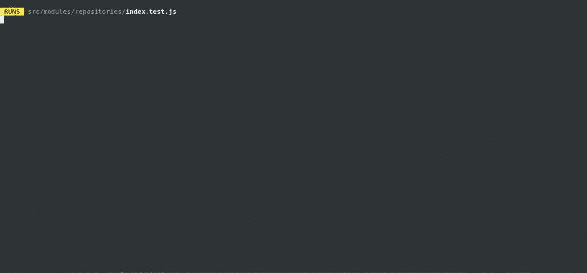

# Test Code Project for GitFast [preview](https://code-test-gitfast.web.app/) 
[](https://GitHub.com/DiegoAWS/code-test-gitfast)

## Structure

- [Problem to solve](#problem-to-solve)
  - [Objective](#objective)
  - [Requirements](#requirements)
  - [Routes](#routes)
- [Further recomendations](#further-recomendations)
- [Deployed Project](#deployed-project)
- [Runing the project locally](#runing-the-project-locally)
- [Testing](#testing)

You can see the live project at [this firebase hosting.](https://code-test-gitfast.web.app/)

[](https://code-test-gitfast.web.app/)

Test running proccess, to reproduce test locally follow instructions [here](#testing)

[](#testing)

[](#readme)

## Problem to solve:

### Objective

The goal of this project will be to create a web application that shows git commit history for the project you're working on (looks a lot like recursion, huh?). You need to make many well-stated commits while working on this project and regularly push them up.

You will need to sign up for a free GitHub account if you do not already have one, then create a public repository to store your work so that we will be able to see and review it. You can find documentation on the GitHub API here: https://developer.github.com/v3/.

Please make sure that you use React and Redux.

[](#readme)

### Requirements

You must use the GitHub API - while you could make a scraper or devise another method to get the git commit history of your project, we would like to see how you work with an existing API.
Your GitHub repository must be public - this will allow us to look at it and verify the accuracy of your code. Once you complete this project, you will need to send over the link to your project to us with the email address provided below.

The style of the page is up to you. Typically we use something like Bootstrap (http://getbootstrap.com) for a lot of our projects, then style it to meet the business want or need later on.

[](#readme)

### Routes

- One route for the repo/commits,
- One route should contain profile information, and
- the final route can contain any additional information that you find could be useful from the API.

You MUST provide instructions in the README on how to install and run your project. We will not infer anything, and if you do not include these instructions, we will reject your submission.
When you are finished please email me with a link to the repo. If you have any questions let me know.

[](#readme)

## Further recomendations

1. Change tunk by saga

2. Create at least 3 types of action per model plus one loading type for each model

3. Trigger the loading whenever you are looking for some data and turn it off when the data reaches the front

4. Use that loading in each component to tell the user that you are looking for something from that model or view.

5. Add an error type and also show it in each view (or it can be a global notification)

6. Change to type strip and use custom types suitable for each model

7. Switch from classes to functions

8. Change the use of redux connect to react hoooks (useselector usedispatch)

9. Improve the readme to describe what that repository does and how it can be deployed from scratch.

10. Use a pattern for the redux state something like state: {data, loding, error}

11. Use a folder pattern for redux (one folder per model) and inside a file for each thing (reducer, service / api, type, saga / middleware)

12. Adding unit tests by visual components and by api / service functions will test each view and each function one by one. Functions and data mock will be used preferably using jest.

13. Regarding the use of git, each task must be in a separate branch, each functionality of the task one or more commits, it is never directly uploaded to master, a PR of a tested branch is made, it must be used as a minimum master dev and the branches of each functionality, it is first mixed with dev and it is tested again and in the end it is passed to master.
    <br> <br><br>

[](#readme)

## Deployed Project

To see this project you could visit https://code-test-gitfast.web.app/ or you could clone it and run it locally.
<br> <br><br>

[](#readme)

## Runing the project locally


Before start make sure you have installed this tools:

- [Node JS](https://nodejs.org/en/) – LTS version or newer.
- [NPM](https://www.npmjs.com/) – Usually comes with Node.
- [Git](https://git-scm.com/) – Git CLI.

To make sure you have this tool installed please open a terminal and type:

```
node --version
```

```
npm --version
```

and

```
git --version
```

expecting something similar to (o newer versions):

```sh
node --version
v14.17.0

npm --version
6.14.13

git version
git version 2.20.1
```

Once you have installed `node` `npm` and `git` you can download/install this project:

```
git clone https://github.com/DiegoAWS/code-test-gitfast.git
cd code-test-gitfast
npm install
npm start
```

You will see the project in a browser at http://localhost:3000/

[](#readme)

## Testing

Test are availables with [Jest testing Framework](https://jestjs.io/). After running [commands above](#runing-the-project-locally), please run in the project directory:

```
npm test
```
